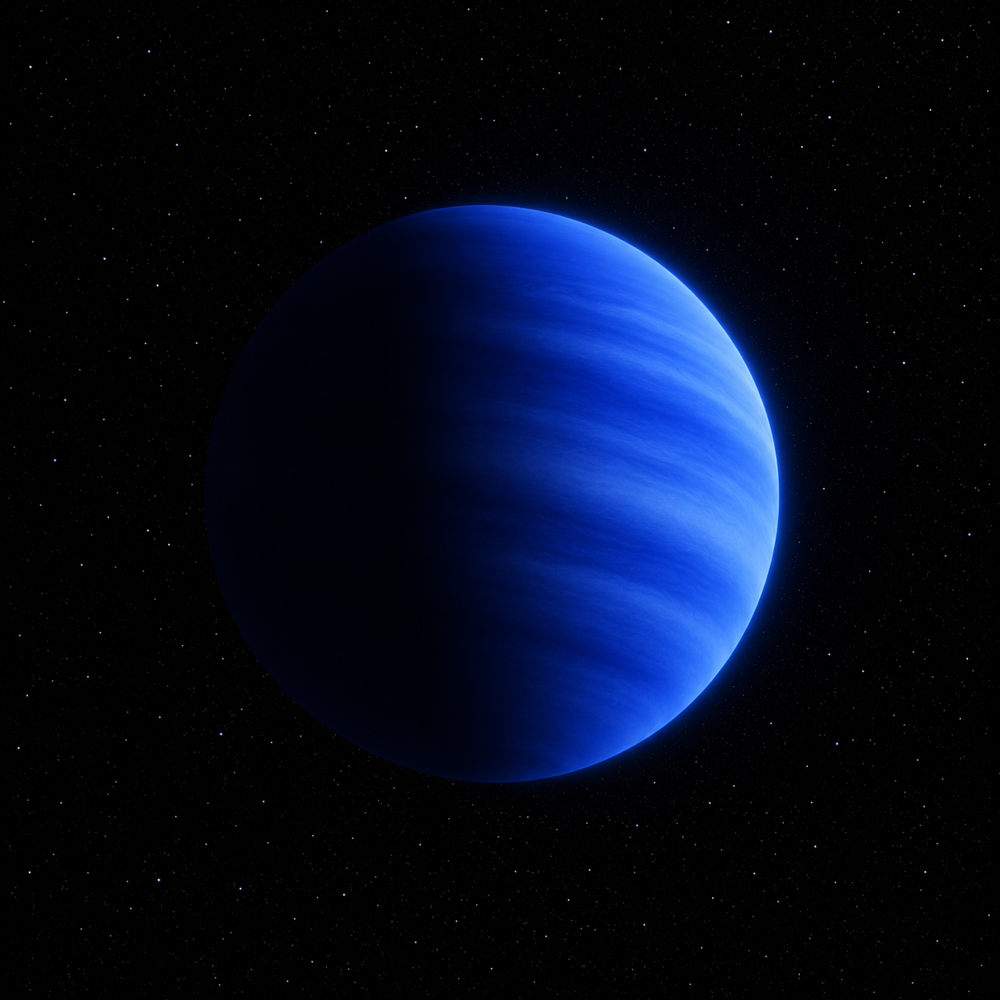

# HD 189733 b — Exoplanet Atmosphere Report

<p align="center">
  
</p>

<p align="center"><em>AI-generated artist's concept — not a real photograph. See the report for actual JWST NIRCam data.</em></p>

The "blue planet" — famous for scattered-light Rayleigh haze that gives it
its inferred azure color — and one of the most intensively studied hot
Jupiters ever found. This repo runs a two-window band-contrast statistic
on a high-precision JWST NIRCam transmission spectrum and reports it
next to the molecular detection significances the source paper actually
publishes.

**[Open the full report](https://biswajit1999.github.io/hd189733b-exoplanet-report/)** — the live GitHub Pages version. You can also open `index.html` locally in a browser, or serve it with `python -m http.server` from this directory.

## Data sources

- **System parameters** — from the NASA Exoplanet Archive TAP
  service (`pscomppars` table).
- **JWST NIRCam spectrum** — 139 wavelength bins, 2.4-5.0 microns,
  from Fu et al. (2024), reporting H2S and metal enrichment in this
  atmosphere, released publicly on Zenodo
  ([10.5281/zenodo.11459715](https://doi.org/10.5281/zenodo.11459715)).
- **Analysis** — `scripts/analyze_spectrum.py` computes the weighted mean
  transit depth and compares two wavelength windows (CO2 near
  4.3-4.6 um, an H2O/H2S-influenced window near 2.6-3.0 um) against a
  nearby continuum window, reporting a band-contrast signal-to-noise
  for each next to the paper's own retrieval-based significances. Run
  it yourself:

  ```bash
  pip install -r requirements.txt
  python scripts/analyze_spectrum.py
  ```

## Repository structure

```text
index.html              the report webpage
data/                    JWST NIRCam transmission spectrum (Zenodo)
scripts/analyze_spectrum.py   band-comparison analysis, this script vs. the paper
figures/                 generated plot + summary_statistics.csv
tests/                   unit tests + a regression check against the real data
```

## Tests

`tests/test_analysis.py` checks the weighted-mean and band-selection
functions against hand-computed cases and reruns the full pipeline on
the real downloaded spectrum, verifying it still reproduces the
numbers this README documents — including that the paper's own
retrieval significances stay attached for comparison. Runs
automatically on every push via GitHub Actions; run locally with:

```bash
pytest tests/ -v
```

## What the numbers show

Weighted mean transit depth 24183 ppm. This script's own two-window
comparison gives 239 ppm (22.1σ band S/N) for the CO2 window and 255 ppm
(24.7σ band S/N) for the H2O/H2S window — high signal-to-noise on a
simple contrast test, but not molecular detection significances, since
either window can hold more than one absorber and the continuum choice
shapes the number. Fu et al. (2024) get per-molecule significances from
a full atmospheric retrieval: H2O at 13.4σ, CO2 at 11.2σ, CO at 5σ, H2S
at 4.5σ. Both approaches agree the spectrum has real structure in these
regions; only the retrieval identifies which molecule causes it.

## Limitations

The two-window comparison here can't attribute an absorption feature to
a specific molecule on its own — a full retrieval, which models every
absorber and the continuum simultaneously, is what the source paper
actually uses to reach its molecule-by-molecule significances. This
repo's own band-contrast numbers are useful as a quick look at where
the spectrum has structure, not as a substitute for that retrieval.

## References

1. Bouchy, F. et al., 2005. A very hot Jupiter transiting the bright K star
   HD 189733. *Astronomy & Astrophysics*, 444(1), pp.L15-L19.
2. Knutson, H.A. et al., 2007. A map of the day-night contrast of the
   extrasolar planet HD 189733b. *Nature*, 447, pp.183-186.
3. Pont, F. et al., 2013. The prevalence of dust on the exoplanet HD
   189733b from Hubble Space Telescope camera spectroscopy. *Monthly
   Notices of the Royal Astronomical Society*, 432(4), pp.2917-2944.
4. Fu, G. et al., 2024. Hydrogen sulfide and metal-enriched atmosphere for
   a Jupiter-mass exoplanet. *Nature*, 632, pp.752-757 (arXiv:2407.06163)
   — source of the spectrum and the retrieval significances quoted above.
5. Zenodo record
   [10.5281/zenodo.11459715](https://doi.org/10.5281/zenodo.11459715),
   "Products for 'Hydrogen sulfide and metal-enriched atmosphere for a
   Jupiter-mass exoplanet.'"
6. NASA Exoplanet Archive, <https://exoplanetarchive.ipac.caltech.edu/>.

## Author

Biswajit Jana — [Portfolio](https://biswajit1999.github.io/Biswajit_Jana.github.io/) · [GitHub](https://github.com/Biswajit1999) · [LinkedIn](https://www.linkedin.com/in/biswajit-jana-27011a151/) · [ORCID](https://orcid.org/0009-0002-2411-1891)
